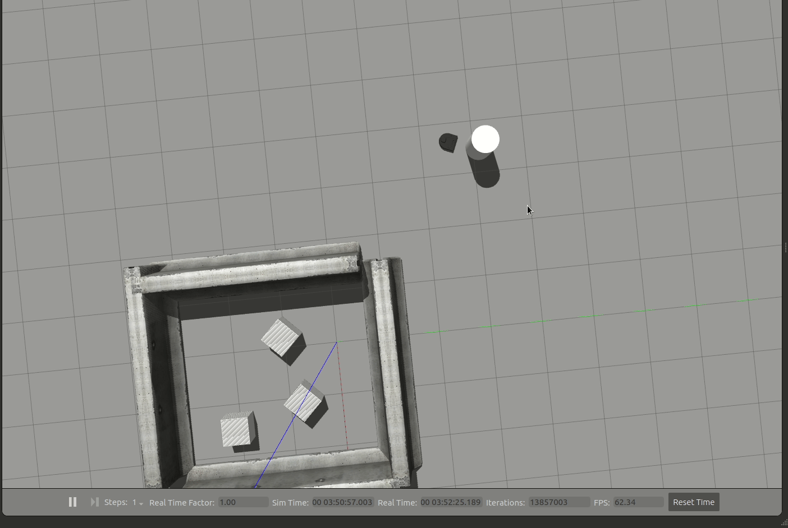
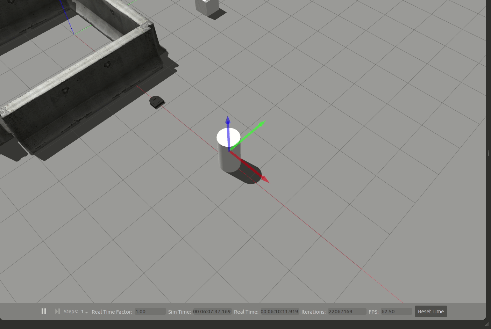

# Warm Up Project
Computational Introduction to Robotics, Olin College of Engineering, FA2020
James Ho, Adi Ramachandran, Richard Gao
This repository contains code for an introduction to ROS project that involves programming behaviors for a two wheeled Neato robot.

## Marker.py - Adi
We started with the starter marker code provided to us and built a Python class and some OOP structure around it. We also added some ROS boilerplate to create a ROS node and publish to marker data to the correct topic. 

## Teleop.py - James
We used the code provided in the assignment description to read the last keyboard command. A function was written to read the keyboard input and publish the corresponding Twist message to /cmd_vel to drive the neato. 

## Drive_square.py - James & Adi 

Wrote code to drive the robot in a square via taking continual positional data from subscriptions to both the /imu and /odom topics. We grabbed positional data relative to the Neato’s starting point from the /odom topic, and we grabbed orientation data about the data from the /imu topic. We opted to use the IMU over the odometry because it is more robust when it comes to dealing with outside forces. For instance, in the case of a wheel slipping, the odometry would falsely update the neato’s orientation while the IMU would not. 

Our main run_odom function would run the robot through a continual while loop unless the esc command was triggered or if the robot had completed more than 3 ‘sidelengths’. The function would check if the robot had completed traveling straight the length of the square sidelength - if not, it would continue driving straight at a speed proportional to the distance left it needed to travel at. If the robot had completed the distance of a sidelength, it would check how much of the angle it had rotated through, compute a proportional angular speed based on the angle left it needed to turn, and turn the rest of the 90 degrees. If the Neato had completed the full 90 degree turn, it would call reset_vals(), where its position and orientation would be recorded for reference to complete the next sidelength, and the number of sidelengths completed would increment. 

Repeat the process 4 times till the completion of the square shape.  

## Wall Follower - Richard

The wall follower behavior is composed of two states: moving along a wall that is detected on one of its sides (left or right), or making sharp rotations when the neato encounters a wall in front of it. We handle these two states in the functions `moving_along_wall` and `change_wall` respectively. 

The core of the wall follower is handled in the `moving_along_wall` state. The goal in this state is to orient the Neato parallel to the closest wall within 1 meter on either of its sides, and then drive forwards while maintaining its parallel relationship. To accomplish this we use the method as shown in the following image:

We optimize the Neato’s heading so that it’s horizontal axis is perpendicular to the wall. By doing this, we ensure that the Neato always stays parallel and follows the wall. To do this, we match lidar scans that are equally angled above and below the Neato’s horizontal and use proportional control to get them as equal to each other as possible. In implementation, we use a sweep of angles instead of one pair to make this process less error prone and more robust.

The `change_wall` state handles the case where the Neato detects a wall directly in front of its heading. Here, the Neato decides to rotate either left or right depending on which side the current wall is on, and essentially changes the designated wall by rotating such that it is now parallel to the new wall. This is done by rotating for a fixed length of time, long enough to trigger the frontal wall as a new side wall. Once the time is up, the control is given back to the `moving_along_wall` state that finalizes the rotation and optimization. With this, our wall follower is able to handle corners and sharp turns.
 
## Person Follower - James & Adi

Our person following algorithm followed a generally naive implementation. It subscribes to the LIDAR point values published by the neato on the /scan topic. It simply moves in the direction indicated by the LIDAR to have the least distance to an obstacle / person. 

It’s main loop begins by checking to see if the Point of Interest (POI) is less than .5 meters away - if yes, the Neato will cease to move. 
If not, the Neato will check and adjust its direction. We check to make sure it turns the right way based on the value in radians stored within the POI variable. The angular speed is proportional to the angle left to cover by the Neato while turning. 
If the direction falls within an acceptable range, the Neato begins to move straight towards the POI, with its speed proportional to its distance away from the object. 
We run both the angular and linear speed through a sigmoid function to limit its speed & handle the edge case where the Neato wants to speed off into infinity. 

## Obstacle Avoidance - Adi

The obstacle avoidance code uses a ‘force field’ implementation, clustering objects based on 2D lidar scan data, calculating their directions relative to the Neato’s orientation, and factoring them into a 2D force field that effectively drives the Neato. The Neato is driven towards an overall net_force, which is a vector representing the sum of a main positive driving force [10.0,0], and a negative force for every detected discrete object. This continues indefinitely. 

We’ll explore the code by exploring its shortcomings. 

It has some issues with ‘LIDAR clustering’. Much of the lidar clustering - converting 2D lidar data into directions representing discrete obstacles - was based off of this method on github [here](https://github.com/kostaskonkk/datmo). In summary, our algorithm follows something somewhat similar to the Adaptive Breakpoint Detector algorithm, however the distance threshold Dth used to determine if two consecutive LIDAR scan points were part of different or the same object was hardcoded as opposed to being dynamic. 

Additionally, because the scanning starts at 0 and ends at 360, the array isn’t continuous / doesn’t wrap around - resultantly, if an object sits directly in front of the Neato, the clustering algorithm will pick the object up as 2 objects at both ends of the array. 

A large shortcoming - our force calculations didn’t use the objects’ positions / distances away from the Neato when factoring their repulsive forces into the force field, it only factored the central angle representing their direction relative to the Neato’s current orientation & position. This causes the Neato, after avoiding / moving past an obstacle, to continue to be affected by the obstacle. This is quite easy to factor in but was realized after submission. 

## Finite state control - Richard

Our finite state controller consists of two states: seeking and person following.

The Neato always starts in the seeking state. Here, it sweeps back and forth by a designated theta (we set this to 60°) and checks the lidar scans from 0°-90° and 270°-0° (essentially the front of the Neato for any objects that comes within a tracking range (we set this to 2 meters). This was done to emulate a seeking behavior that moves its tracking area to hunt for objects. The Neato transitions to the person following state once an object is detected within the scanning area. In the person following state, the Neato rotates its heading to face the object and then drives forward always orienting itself to follow the said object as long as it remains in its tracking area (visualized in rviz with the blue area in front). If the object leaves the tracking area by crossing a large distance quickly, the Neato transitions back to the seeking state.

## Challenges & Improvements
As a team, we all became more comfortable working with the basic ROS framework. Working through each component taught us how to use the various ROS objects and familiarized us with the workflow. One of the challenges we faced was troubleshooting our implementations of each behavior effectively. For instance, we spent a lot of time trying out different ways for turning in the Drive Square section. Some attempts led to other sections of our code breaking or the neato behaving unexpectedly. After working through a few problems, we realized that taking the time to think through solutions before writing any code significantly reduced the number of logical bugs later on. We spent more time planning when working on the person follower and encountered significantly fewer bugs during its implementation. We seek to improve our workflow effectiveness and efficiency by placing emphasis on planning before implementing as well as incremental development to continuously check our code.

One improvement that can be made is to create more informative visualizations using rviz. In doing so, it could be helpful for debugging and for understanding. A roadblock that we encountered while using the Markers was with removing them from the scene. Despite, debugging and researching online, we weren’t able to independently remove markers already placed in rviz. Using the documentation provided which stated to use the delete action when implementing, the markers either stopped displaying or never left the scene. This is why in the visualization for the finite state behavior, the scan area and POI sphere never reset. If given more time, this issue would be investigated further to make the visualizations more telling.
 
## Final Remarks/ Takeaway
Coming into this project, we all had little experience with the ROS framework. Having worked through these challenges, we all walked away feeling more comfortable working with ROS nodes and common robotic software frameworks. Some members also learned how to work more effectively when developing complex software. We also realized that building behaviors from scratch is very time consuming and have developed an appreciation for the ability to reuse open source ROS packages. Overall, we found the project to be very engaging and full of learning opportunities. 

